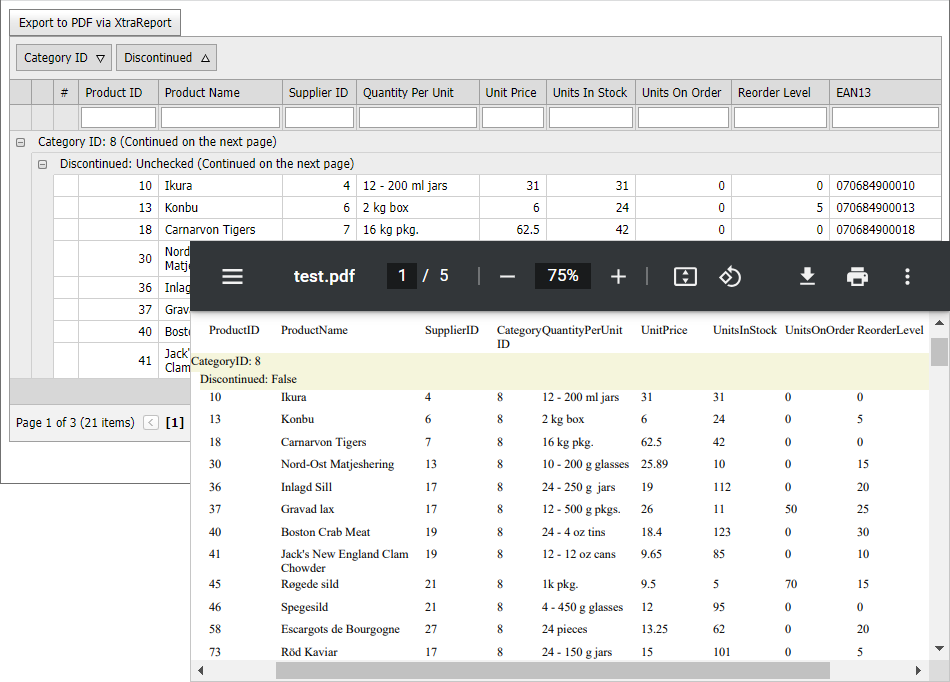

<!-- default badges list -->

<!-- default badges end -->
# Grid View for ASP.NET MVC - How to create a report based on grid data
<!-- run online -->
**[[Run Online]](https://codecentral.devexpress.com/e4755/)**
<!-- run online end -->
This example demonstrates how to dynamically create a [DevExpress report](https://docs.devexpress.com/XtraReports/DevExpress.XtraReports.UI.XtraReport) based on the [Grid View](https://docs.devexpress.com/AspNetMvc/DevExpress.Web.Mvc.GridViewExtension) extension's data and layout. The resulting report maintains all sorting, grouping, and filtering settings applied to the grid. The example code exports this report to a PDF file, but you can also insert the resulting report into another report.

Follow the steps below to create a report based on the Grid View extension's data:

1. Use [session state](https://learn.microsoft.com/en-us/previous-versions/ms178586(v=vs.140)) to pass Grid View's layout settings to the controller.
2. Create an instance of the [XtraReport](https://docs.devexpress.com/XtraReports/DevExpress.XtraReports.UI.XtraReport) class.
3. Bind the instance to the Grid View's data source.
4. Based on the Grid layout, create [bands](https://docs.devexpress.com/XtraReports/2587/detailed-guide-to-devexpress-reporting/introduction-to-banded-reports) and add them to the report.
5. Create [report controls](https://docs.devexpress.com/XtraReports/2605/detailed-guide-to-devexpress-reporting/use-report-controls) and add them to the bands.

## Files to Review

* [Index.cshtml](./CS/E4755/Views/Home/Index.cshtml) (VB: [Index.vbhtml](./VB/E4755/Views/Home/Index.vbhtml))
* [_GridViewPartial.cshtml](./CS/E4755/Views/Home/_GridViewPartial.cshtml) (VB: [_GridViewPartial.vbhtml](./VB/E4755/Views/Home/_GridViewPartial.vbhtml))
* [HomeController.cs](./CS/E4755/Controllers/HomeController.cs) (VB: [HomeController.vb](./VB/E4755/Controllers/HomeController.vb))
* [ReportHelperMVC.cs](./CS/E4755/Models/ReportHelperMVC.cs) (VB: [ReportHelperMVC.vb](./VB/E4755/Models/ReportHelperMVC.vb))
* [MVCxGridViewState.cs](./CS/E4755/Models/MVCxGridViewState.cs) (VB: [MVCxGridViewState.vb](./VB/E4755/Models/MVCxGridViewState.vb))

## Documentation

* [Create a Report in Code](https://docs.devexpress.com/XtraReports/115726/detailed-guide-to-devexpress-reporting/reporting-api/create-reports-in-code)

## More examples

* [Grid View for ASP.NET Web Forms - How to create a report based on grid data](https://github.com/DevExpress-Examples/asp-net-web-forms-gridview-create-report-based-on-grid-layout)

